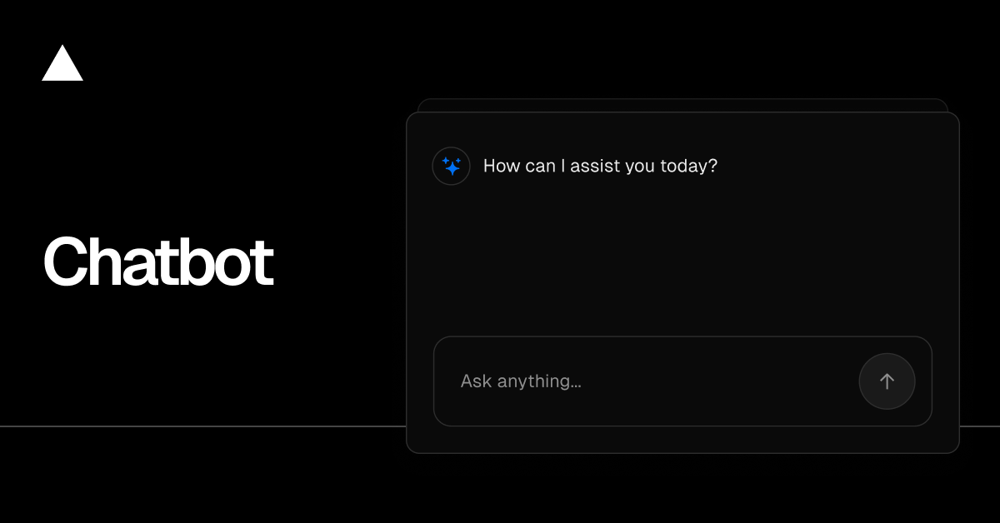

<a href="https://chatbot.ai-sdk.dev/demo">
  
  <h1 align="center">Spaghetti-GPT</h1>
</a>

    Spaghetti-GPT is a customized, detemplated version of the Vercel AI Chatbot template. Built with Next.js, AI SDK, shadcn/ui, and integrated for SpaghettiStories / personal AI agent use cases.

  <a href="#features"><strong>Features</strong></a> ·
  <a href="#deploy-your-own"><strong>Deploy Your Own</strong></a> ·
  <a href="#running-locally"><strong>Running locally</strong></a>

 

## Current Status (June 10, 2026)

- Postgres integration: Attached
- AUTH_SECRET: Set
- Attempting fresh deployment from current main to pick up latest detemplated code + env vars
- "User not found" errors still occurring on previous deployment (In progress)

## Features

- Next.js App Router with React Server Components
- AI SDK for multi-provider LLM support (OpenRouter, OpenAI, xAI/Grok, etc.)
- shadcn/ui + Tailwind
- Auth.js for authentication (guest + more)
- Drizzle + Vercel Postgres for persistence
- Vercel Blob for file uploads
- Custom model configs in lib/ai/models.ts

## Deployment on Vercel

This project is linked to Vercel GitHub integration for automatic deploys on push to `main`.

## Environment Setup

Required:
- Vercel Postgres (attached)
- AUTH_SECRET (set)
- AI provider key (e.g. OPENROUTER_API_KEY)

## Running locally

Copy `.env.example` to `.env.local`, fill keys, `pnpm install`, `pnpm dev`.

> Customized from Vercel Chatbot template for Spaghetti-GPT use case.
